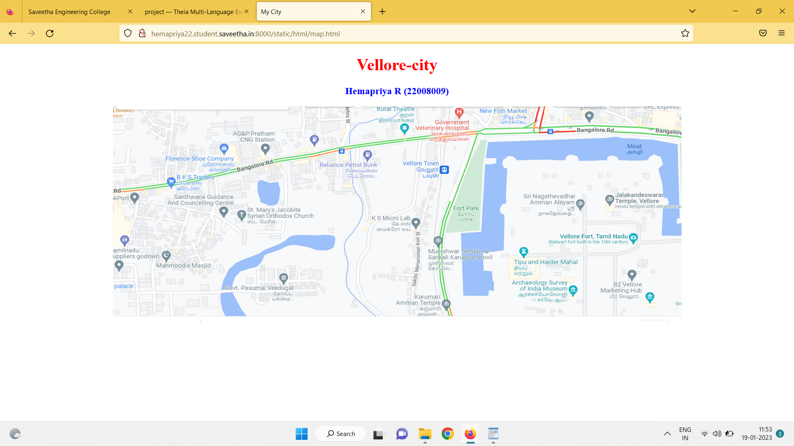
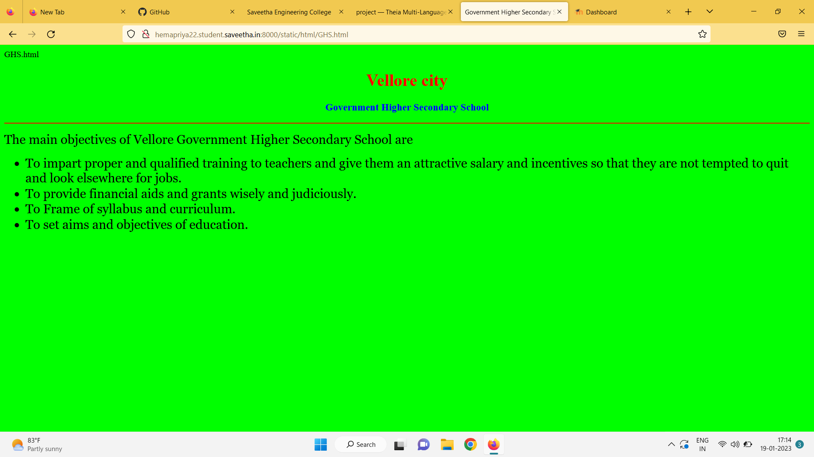
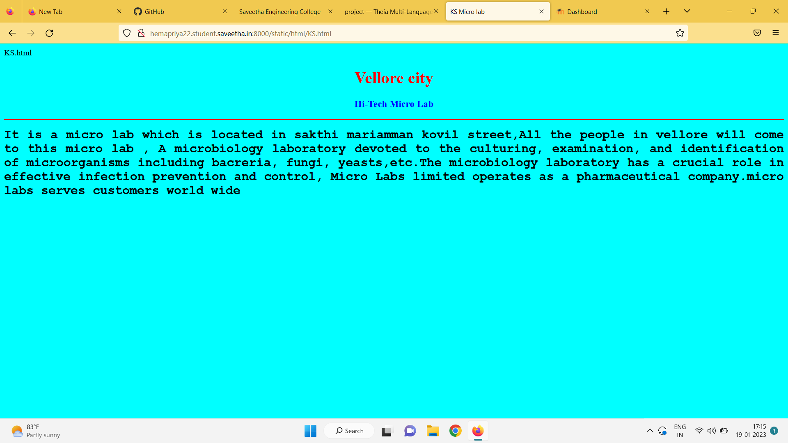
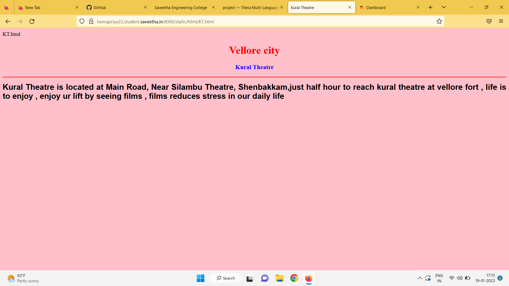
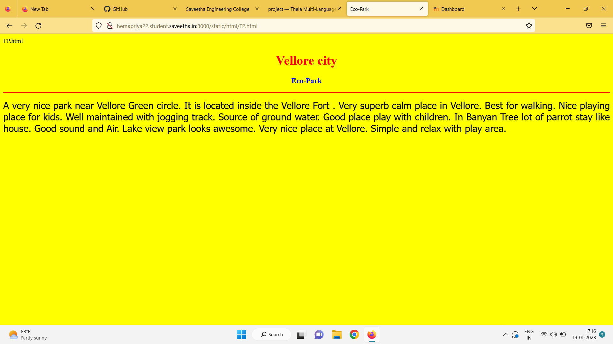
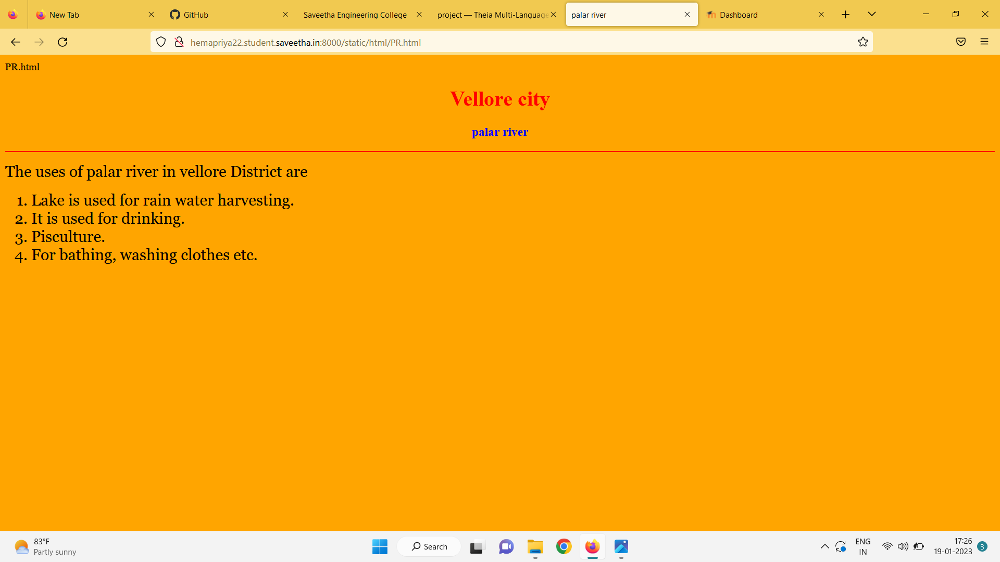

# Places Around Me
## AIM:
To develop a website to display details about the places around my house.

## Design Steps:

### Step 1:
clone the github repository into Theia IDE

### Step 2:
create a new Django project

### Step 3:
Write the needed HTML code.

### Step 4:
Run the Dajango server and excute the HTML files.

## Code:
```
map.html
<!DOCTYPE html>
<html lang="en">
<head>
<title>My City</title>
</head>
<body>
<h1 align="center">
<font color="red"><b>Vellore-city</b></font>
</h1>
<h3 align="center">
<font color="blue"><b>Hemapriya R (22008009)</b></font>
</h3>
<center>

<map name="MyCity">
<area shape="circle" coords="190,50,40" href="/static/html/KS.html" title="KS Micro lab">
<area shape="rectangle" coords="230,30,260" href="/static/html/KT.html" title="Kural Theatre">
<area shape="circle" coords="400,350,20" href="/static/html/RPB.html" title="Government Higher secondary schoolSS">
<area shape="circle" coords="400,200,75" href="/static/html/FP.html" title="Fort Park">
<area shape="rectangle" coords="490,150,87" href="/static/html/ST. M .html" title="Palar river">
</map>
</center>
</body>
</html>

GHS.html
<!DOCTYPE html>
<html lang="en">
<head>
<title>Government Higher Secondary School</title>
</head>
<body bgcolor="lime">
<h1 align="center">
<font color="red"><b>Vellore Town</b></font>
</h1>
<h3 align="center">
<font color="blue"><b>Government Higher Secondary School</b></font>
</h3>
<hr size="3" color="red">
<p align="justify">
<font face="Georgia" size="5">
The main objectives of Vellore  Government Higher Secondary School are 
<ul>
<li>To impart proper and qualified training to teachers and give them an attractive salary and incentives so that they are not tempted to quit and look elsewhere for jobs.</li>
<li>To provide financial aids and grants wisely and judiciously.</li>
<li>To Frame of syllabus and curriculum.</li>
<li>To set aims and objectives of education.</li>
</ul>
</font>
</p>
</body>
</html>

KS.html
<!DOCTYPE html>
<html lang="en">
<head>
<title>KS Micro lab</title>
</head>
<body bgcolor="cyan">
<h1 align="center">
<font color="red"><b>Vellore city</b></font>
</h1>
<h3 align="center">
<font color="blue"><b>Hi-Tech Micro Lab</b></font>
</h3>
<hr size="3" color="red">
<p align="justify">
<font face="Courier New" size="5">
<b>
It is a micro lab which is located in sakthi mariamman kovil street,All the people in vellore will come to this micro lab , A microbiology laboratory devoted to the culturing, examination, and identification of microorganisms including bacreria, fungi, yeasts,etc.The microbiology laboratory has a crucial role in effective infection prevention and control, Micro Labs limited operates as a pharmaceutical company.micro labs serves customers world wide
</b>
</font>
</p>
</body>
</html>
KT.html
<!DOCTYPE html>
<html lang="en">
<head>
<title>Kural Theatre</title>
</head>
<body bgcolor="pink">
<h1 align="center">
<font color="red"><b>Vellore city</b></font>
</h1>
<h3 align="center">
<font color="blue"><b>Kural Theatre</b></font>
</h3>
<hr size="3" color="red">
<p align="justify">
<font face="Arial" size="5">
<b>
Kural Theatre is located at Main Road,  Near Silambu Theatre, Shenbakkam,just half hour to reach kural theatre at vellore fort , life is to enjoy , enjoy ur lift by seeing films , films reduces stress in our daily life 
</b>
</font>
</p>
</body>
</html>

PR.html
<!DOCTYPE html>
<html lang="en">
<head>
<title>palar river</title>
</head>
<body bgcolor="orange">
<h1 align="center">
<font color="red"><b>Vellore city</b></font>
</h1>
<h3 align="center">
<font color="blue"><b>palar river</b></font>
</h3>
<hr size="3" color="red">
<p align="justify">
<font face="Georgia" size="5">
The uses of palar river in vellore District are 
<ol type="1">
<li>Lake is used for rain water harvesting.</li>
<li>It is used for drinking.</li>
<li>Pisculture.</li>
<li>For bathing, washing clothes etc.</li>
</ol>
</font>
</p>
</body>
</html>

FP.html
<!DOCTYPE html>
<html lang="en">
<head>
<title>Eco-Park</title>
</head>
<body bgcolor="yellow">
<h1 align="center">
<font color="red"><b>Vellore city</b></font>
</h1>
<h3 align="center">
<font color="blue"><b>Eco-Park</b></font>
</h3>
<hr size="3" color="red">
<p align="justify">
<font face="Tahoma" size="5">
A very nice park near Vellore Green circle. It is located inside the Vellore Fort . 
Very superb calm place in Vellore. Best for walking. Nice playing place for kids.
Well maintained with jogging track. Source of ground water.
Good place play with children.  In Banyan Tree lot of parrot stay like house. 
Good sound and Air. Lake view park looks awesome.
Very nice place at Vellore.
Simple and relax with play area.
</font>
</p>
</body>
</html>
```
## Output:












## HTML Validator

## Result:
The program for implementing image map is excuted sucessfully